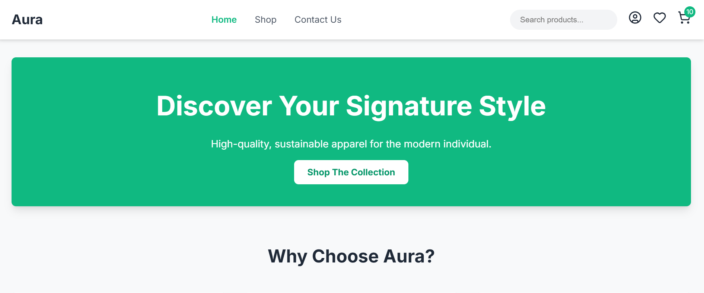

# Aura - Modern E-Commerce Website

A responsive, single-page e-commerce application built with vanilla JavaScript, featuring a modern design and seamless user experience.


*Home page showcasing the modern design and product grid*

## 🚀 Live Demo

[🔗 View Live Website](https://natnaelkornima.github.io/Aura/)

## 🚀 Features

### Core Functionality
- **Single-Page Application (SPA)** - Smooth navigation between pages without reloads
- **Product Catalog** - Dynamic product grid with filtering capabilities
- **Shopping Cart** - Add/remove items with real-time quantity updates
- **Responsive Design** - Optimized for desktop, tablet, and mobile devices

### Product Management
- **Advanced Filtering** - Filter by category, price range, size, and color
- **Product Search** - Search functionality in the header
- **Product Display** - Hover effects with quick add-to-cart buttons
- **Inventory Management** - Size and availability tracking

### User Experience
- **Mobile-First Design** - Collapsible mobile menu and optimized touch interfaces
- **Interactive Panels** - Slide-out cart and filter panels
- **Form Validation** - Client-side validation for contact forms
- **Smooth Animations** - CSS transitions and fade-in effects

## 🛠️ Technology Stack

### Frontend
- **HTML5** - Semantic markup with template tags
- **CSS3** - Custom properties (CSS Variables), Flexbox, Grid, and responsive design
- **Vanilla JavaScript** - No frameworks, pure ES6+ JavaScript
- **Lucide Icons** - Modern, customizable icon library

### Design System
- **Color Palette** - Emerald green primary colors with gray scale
- **Typography** - Inter font family for modern readability
- **Component-Based** - Reusable UI components (cards, buttons, forms)

## 📁 Project Structure

```
aura-ecommerce/
├── index.html              # Main HTML file with template structure
├── css/
│   └── styles.css          # Comprehensive stylesheet with CSS variables
├── js/
│   └── script.js           # Main JavaScript application logic
├── assets/                 # Product images and media files
└── README.md              # Project documentation
```

## 🎯 Key Components

### Navigation & Layout
- Sticky header with logo and navigation
- Mobile hamburger menu
- Desktop navigation with active state indicators
- Shopping cart with item counter

### Pages
1. **Home Page** - Hero section, feature highlights, testimonials
2. **Products Page** - Filterable product grid with sidebar filters
3. **Contact Page** - Contact form with validation and business information

### Interactive Elements
- **Shopping Cart Panel** - Slide-out cart with quantity controls
- **Filter Panel** - Mobile-friendly filter interface
- **Product Cards** - Hover effects and quick add-to-cart
- **Form Validation** - Real-time error handling and success messages

## 🔧 Installation & Setup

1. **Clone or Download** the project files
2. **Serve the Files** using a local web server:
   ```bash
   # Using Python 3
   python -m http.server 8000
   
   # Using Node.js (if you have http-server installed)
   npx http-server
   
   # Using PHP
   php -S localhost:8000
   ```

3. **Open in Browser** - Navigate to `http://localhost:8000`

## 📱 Responsive Breakpoints

- **Mobile**: < 768px
- **Tablet**: 768px - 1023px  
- **Desktop**: ≥ 1024px

## 🎨 Customization

### CSS Variables
The project uses CSS custom properties for easy theming:

```css
:root {
    --emerald-500: #10B981;    /* Primary brand color */
    --emerald-600: #059669;    /* Primary hover state */
    --gray-100: #f3f4f6;       /* Light backgrounds */
    --gray-800: #1f2937;       /* Main text color */
    /* ... more variables */
}
```

### Adding Products
Modify the `productsData` array in `script.js`:

```javascript
const productsData = [
    {
        id: 13,
        name: 'New Product Name',
        price: 99.99,
        img: './assets/new-product.jpg',
        category: 'Category',
        size: ['S', 'M', 'L'],
        color: 'Color'
    },
    // ... more products
];
```

## 🔄 JavaScript Architecture

### Main Modules
- **Navigation System** - Page routing and template management
- **Product Management** - Rendering, filtering, and cart operations
- **Cart System** - Add/remove items, quantity controls, totals
- **Form Handling** - Validation and submission logic
- **UI Components** - Panel toggles, mobile menus, and interactions

### Key Functions
- `navigateTo(page)` - Handles SPA navigation
- `renderProducts(products)` - Dynamically renders product grid
- `setupFilters()` - Manages filter logic and UI
- `addToCart(productId)` - Cart management functionality

## 🌟 Browser Support

- Chrome (latest)
- Firefox (latest)
- Safari (latest)
- Edge (latest)

## 📄 License

This project is for demonstration purposes. All product images and branding are fictional.

## 🚀 Future Enhancements

Potential features for expansion:
- User authentication and accounts
- Product reviews and ratings
- Wishlist functionality
- Payment integration
- Order history
- Advanced search with sorting
- Product comparison
- Inventory management system

---

**Built with modern web standards and best practices for performance and accessibility.**

---
### 📞 Contact & Support

For questions or support regarding this project:
- 📧 Email: natnaelkornima78@gmail.com
- 📞 Phone: +251978380005
- 🌐 Website: [https://aura.com](https://natnaelkornima.github.io/Aura/)
- 📍 Location: Ethiopia, Addis Ababa 1165

---

<div align="center">

**⭐ Star this repository if you find it helpful!**

</div>
